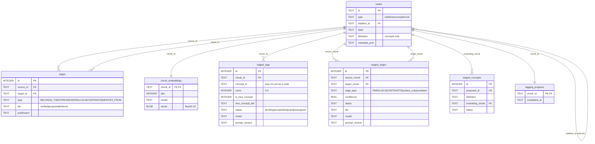
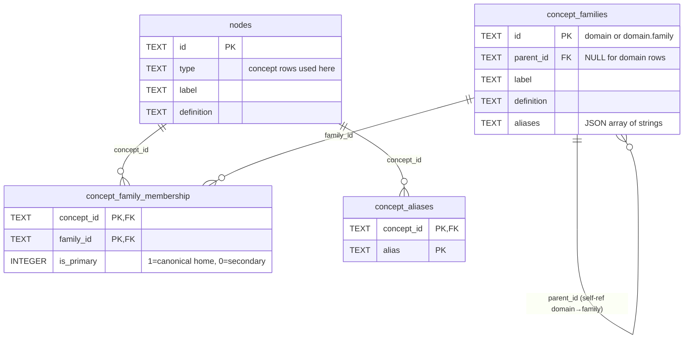
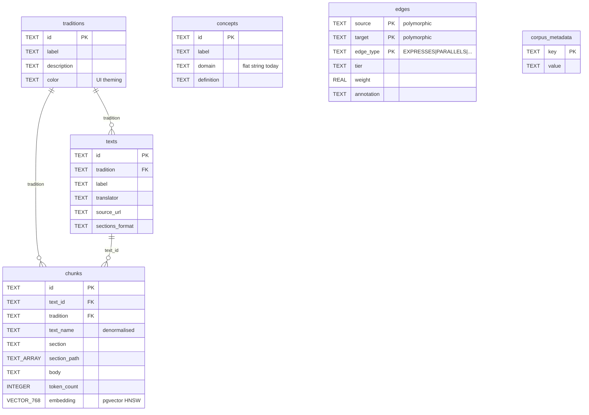
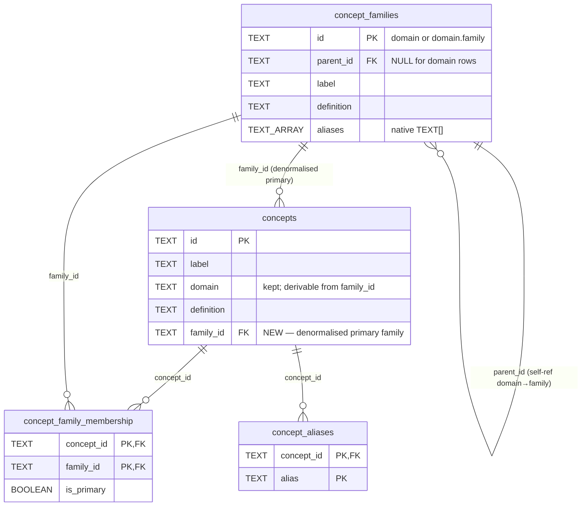

# Schema Diagrams — Local SQLite and Exported Postgres

Visual reference for the two databases in the guru system: the local SQLite (`data/guru.db`) where the pipeline writes, and the exported Postgres on the VPS where guru-web reads. Diagrams are paired before/after the concept-hierarchy migration described in [design.md](design.md).

Rendered with Mermaid `erDiagram`. Tables show primary keys (PK), foreign keys (FK), and key columns. Noise columns (`reviewed_at`, `created_at`, `metadata_json`, etc.) are elided to keep the diagrams readable; consult `scripts/schema.sql` and `guru-web/schema/corpus-schema.sql` for the full column lists.

Pre-rendered SVG artifacts live in [`img/`](img/) — [`local-current.svg`](img/local-current.svg), [`local-future.svg`](img/local-future.svg), [`exported-current.svg`](img/exported-current.svg), [`exported-future.svg`](img/exported-future.svg). Regenerate with `mmdc -i docs/concept-hierarchy/schema-diagrams.md -o docs/concept-hierarchy/img/schema.svg` (requires `@mermaid-js/mermaid-cli` on PATH), then rename `schema-{1,2,3,4}.svg` to the descriptive names above.

---

## 1. Local SQLite — current state

The pipeline source-of-truth. Uses a polymorphic `nodes` table (concepts, chunks, traditions all share an ID space) with `edges` between them. Staging tables hold LLM output pending review; bookkeeping table tracks what's been tagged.

**Reading the model.** `nodes` is the universe of identities. `edges` is the live graph between them — `EXPRESSES` for chunk→concept tags, `PARALLELS` / `CONTRASTS` for cross-tradition concept relationships, `BELONGS_TO` for chunk→tradition membership, `DERIVES_FROM` for derivation chains. Everything in the `staged_*` family is LLM output pending human review; the review CLI promotes accepted rows into `edges` (for tags) or into `nodes` (for new concepts).

The taxonomy lives **outside** this schema today — `concepts/taxonomy.toml` is the source of truth for the flat domain→concept mapping, and `nodes` carries only `id`, `label`, `definition` for each concept with no structural relationship between them beyond what `edges` happens to express.

---

## 2. Local SQLite — future state (post-hierarchy)

**Everything in §1 carries forward unchanged.** This diagram shows only the three new tables and their FK relationship to `nodes` (kept in for context). The migration is purely additive — no existing table touched, no existing concept ID renamed.

`concept_family_membership` enforces "exactly one primary family per concept" via a partial unique index on `(concept_id) WHERE is_primary = 1`. Reverse-lookup index on `(family_id)` supports "which concepts are in this family." `concept_aliases` indexes `alias` for LIKE matching from the query path.

**Population shape.** Family rows ship populated (sync from TOML); `concept_family_membership` ships with `is_primary = 1` rows populated, `is_primary = 0` rows empty in v1; `concept_aliases` ships empty; family `aliases` ship empty or hand-seeded. All four grow organically through review actions and surfaced query patterns; nothing about v1 readiness blocks on alias coverage.

---

## 3. Exported Postgres (guru-web) — current state

The export artifact built by `scripts/export.py` and loaded into the VPS Postgres at `guru-corpus`. Denormalised for read-side simplicity; pgvector handles embeddings; the `edges` table is intentionally polymorphic (untyped `source`/`target` text) so the same table carries chunk↔concept and concept↔concept edges.

**Reading the model.** `traditions` and `texts` are the corpus-organisation skeleton. `chunks` is the searchable substrate, denormalised so a vector hit returns its tradition and text name without joins. `concepts` is a flat list keyed only by ID, with `domain` as a free-form string (no FK, no normalised hierarchy). `edges` is the polymorphic graph — its `source` and `target` are bare text references that the web app resolves against the appropriate table per `edge_type`. `corpus_metadata` is a key/value manifest; loaded last by the export artifact so a mid-load failure leaves it absent and the web app refuses to serve.

**The asymmetry with SQLite.** The pipeline's polymorphic `nodes` table becomes three separate tables (`traditions`, `texts`, `chunks`) on the export side — denormalisation for read performance — and `concepts` becomes its own table. The pipeline's `edges` carries the same shape on both sides; only the FK constraints differ.

---

## 4. Exported Postgres — future state (post-hierarchy)

**Everything in §3 carries forward.** This diagram shows only the three new tables, the new `concepts.family_id` denormalised column, and the `concepts` table for context.

Mirror of the SQLite shape with native Postgres types: `aliases` is `TEXT[]` not JSON, `is_primary` is `BOOLEAN` not `INTEGER`. The conversion is in `export.py`'s `load_families` / `load_concept_family_membership` emitter blocks. The `concepts.family_id` column is intentionally redundant with `concept_family_membership WHERE is_primary` — turns "filter chunks by family" from a three-way join into two-way.

**What's still polymorphic.** `edges` retains its `source`/`target` design — chunks → concepts (EXPRESSES) live alongside concept → concept (PARALLELS, CONTRASTS) in the same table. The hierarchy doesn't add any new edge types. Family-level expansion at retrieval time happens through joins via `concept_family_membership`, not through new edge rows.

**`concepts.domain` kept.** Derivable from `concept_families.parent_id` of the row pointed at by `family_id`, but every existing query in `src/lib/` that filters by domain keeps working unchanged. Removing it is a separate cleanup, out of scope.

---

## 5. The two databases at a glance

| concern | local SQLite | exported Postgres |
|---|---|---|
| **identity model** | polymorphic `nodes` (concepts/chunks/traditions share an ID space) | denormalised: separate `traditions`, `texts`, `chunks`, `concepts` tables |
| **graph** | `edges` with FKs to `nodes` | `edges` polymorphic (`source`/`target` untyped TEXT) |
| **embeddings** | `chunk_embeddings.vector` as float32 BLOB | `chunks.embedding` as pgvector VECTOR(768), HNSW indexed |
| **staging** | `staged_tags`, `staged_edges`, `staged_concepts` (LLM output pending review) | *(none — staging never exported)* |
| **bookkeeping** | `tagging_progress` | *(none — bookkeeping never exported)* |
| **taxonomy structure** (post-migration) | `concept_families` + `concept_family_membership` + `concept_aliases` | same three tables + denormalised `concepts.family_id` |
| **aliases storage** | JSON-encoded text on `concept_families.aliases`; rows in `concept_aliases` | native `TEXT[]` on `concept_families.aliases`; rows in `concept_aliases` |
| **conversion boundary** | `scripts/export.py` (read SQLite → emit Postgres COPY statements) |  |

**What never crosses the boundary.** The `staged_*` tables and `tagging_progress` are pipeline-internal; the export emits only reviewed, promoted state. The hierarchy work doesn't change this: family memberships and aliases are taxonomy state (always exported), not in-flight LLM output (never exported).

**What changes when the hierarchy ships.** From the export pipeline's perspective: three new emitter blocks in `export.py` (`load_families`, `load_concept_family_membership`, `load_concept_aliases`), one enrichment to `load_concepts` (adding `family_id`), and `SCHEMA_VERSION` bumps from 2 to 3. From the consumer's perspective: three new tables to query, one new column on an existing table, and `src/lib/graph.ts` learns to expand family/domain matches into concept sets.
