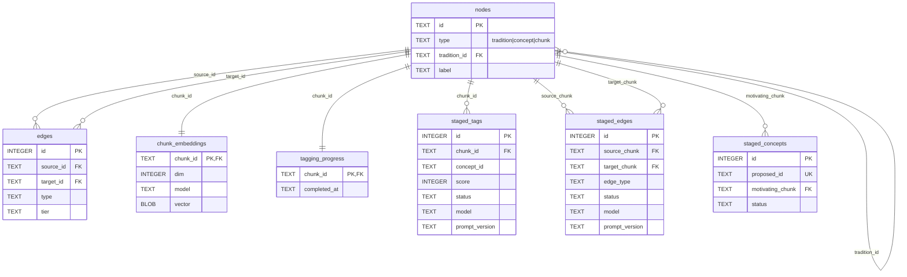
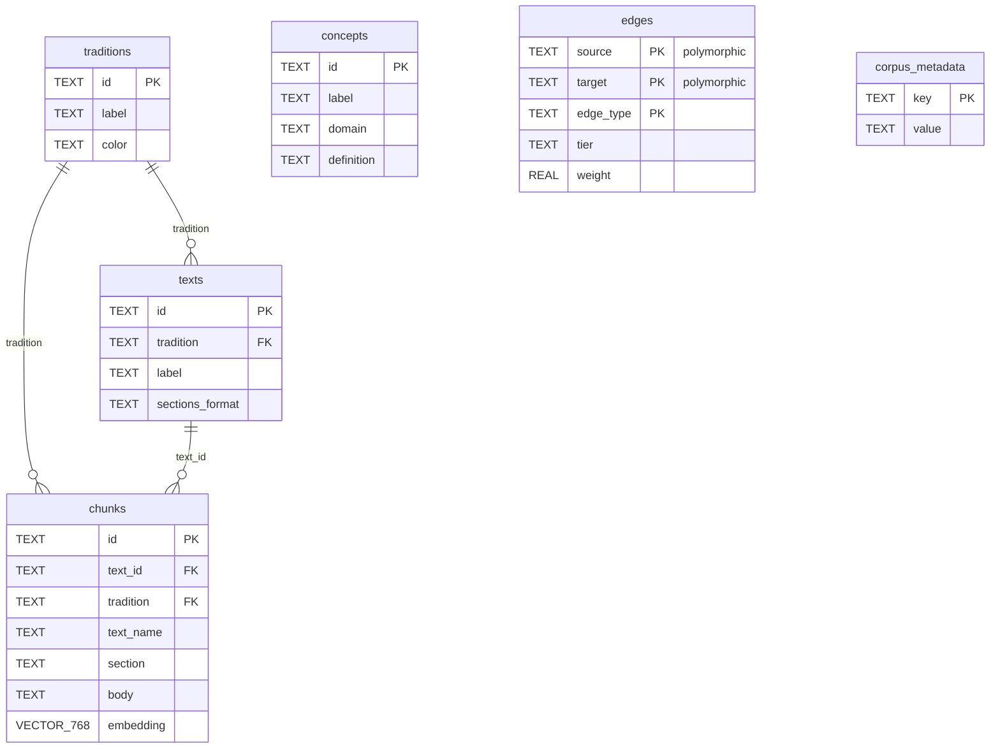
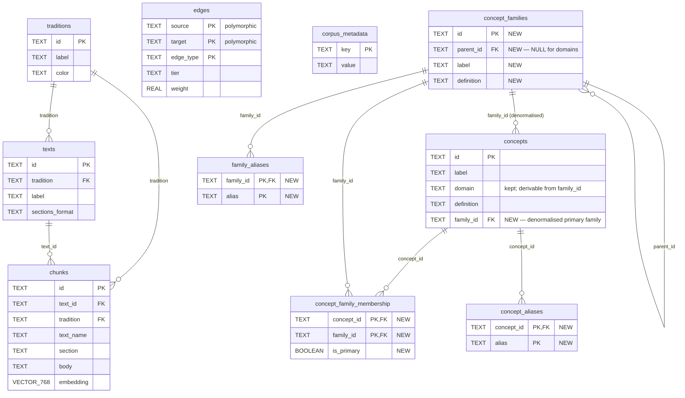

# Schema Diagrams — Local SQLite and Exported Postgres

Four diagrams: local SQLite before and after the concept-hierarchy migration, exported Postgres before and after. Each shows the full database in one diagram. The migration described in [design.md](design.md) is purely additive — every table that exists today persists; the future-state diagrams add three new tables (and, in Postgres, one denormalised column on `concepts`) flagged "NEW" in the column comments.

Rendered with Mermaid `erDiagram`. Noise columns (`reviewed_at`, `created_at`, `metadata_json`, etc.) are elided so the table boxes stay narrow enough for ten-table layouts; consult `scripts/schema.sql` and `guru-web/schema/corpus-schema.sql` for full column lists.

Pre-rendered SVG artifacts live in [`img/`](img/). Regen recipe at the bottom. The SVGs render at intrinsic viewBox size rather than scaling-to-fit — open them in an image viewer or browser for a readable full-size view, scrolling if needed; fit-to-width rendering will shrink them past legibility because of how many tables FK to the central `nodes` table.

---

## 1. Local SQLite — now



Polymorphic `nodes` (concepts, chunks, traditions share an ID space), `edges` between them, `chunk_embeddings` for vector search, `staged_*` for LLM output pending review, `tagging_progress` for bookkeeping. The concept taxonomy lives outside this schema today — `concepts/taxonomy.toml` is the source of truth for the flat domain→concept mapping; `nodes` carries only `id`, `label`, `definition` per concept with no structural relationship between them.

---

## 2. Local SQLite — future (post-migration)

Three new tables: `concept_families`, `concept_family_membership`, `concept_aliases`. Everything from §1 is preserved exactly as-is.

```mermaid
erDiagram
    nodes {
        TEXT id PK
        TEXT type "tradition|concept|chunk"
        TEXT tradition_id FK
        TEXT label
    }

    edges {
        INTEGER id PK
        TEXT source_id FK
        TEXT target_id FK
        TEXT type
        TEXT tier
    }

    chunk_embeddings {
        TEXT chunk_id PK, FK
        INTEGER dim
        TEXT model
        BLOB vector
    }

    tagging_progress {
        TEXT chunk_id PK, FK
        TEXT completed_at
    }

    staged_tags {
        INTEGER id PK
        TEXT chunk_id FK
        TEXT concept_id
        INTEGER score
        TEXT status
        TEXT model
        TEXT prompt_version
    }

    staged_edges {
        INTEGER id PK
        TEXT source_chunk FK
        TEXT target_chunk FK
        TEXT edge_type
        TEXT status
        TEXT model
        TEXT prompt_version
    }

    staged_concepts {
        INTEGER id PK
        TEXT proposed_id UK
        TEXT motivating_chunk FK
        TEXT status
    }

    concept_families {
        TEXT id PK "NEW"
        TEXT parent_id FK "NEW — NULL for domains"
        TEXT label "NEW"
        TEXT definition "NEW"
    }

    concept_family_membership {
        TEXT concept_id PK, FK "NEW"
        TEXT family_id PK, FK "NEW"
        INTEGER is_primary "NEW — 1=canonical, 0=secondary"
    }

    concept_aliases {
        TEXT concept_id PK, FK "NEW"
        TEXT alias PK "NEW"
    }

    family_aliases {
        TEXT family_id PK, FK "NEW"
        TEXT alias PK "NEW"
    }

    nodes ||--o{ nodes : "tradition_id"
    nodes ||--o{ edges : "source_id"
    nodes ||--o{ edges : "target_id"
    nodes ||--|| chunk_embeddings : "chunk_id"
    nodes ||--|| tagging_progress : "chunk_id"
    nodes ||--o{ staged_tags : "chunk_id"
    nodes ||--o{ staged_edges : "source_chunk"
    nodes ||--o{ staged_edges : "target_chunk"
    nodes ||--o{ staged_concepts : "motivating_chunk"
    concept_families ||--o{ concept_families : "parent_id"
    nodes ||--o{ concept_family_membership : "concept_id"
    concept_families ||--o{ concept_family_membership : "family_id"
    nodes ||--o{ concept_aliases : "concept_id"
    concept_families ||--o{ family_aliases : "family_id"
```



`concept_family_membership` enforces "exactly one primary family per concept" via a partial unique index on `(concept_id) WHERE is_primary = 1`, plus `CHECK(is_primary IN (0,1))` against stray values. Reverse-lookup index on `(family_id)`. `concept_aliases` and `family_aliases` are symmetric join tables (same shape, same indexability) and both index `alias` for LIKE matching from the query path. FKs from membership/alias tables to `nodes`/`concepts` use ON DELETE CASCADE so concept deletion cleans up dependent rows automatically. Family rows ship populated (from `concepts/taxonomy.toml`); membership rows ship with `is_primary = 1` populated and `is_primary = 0` empty in v1; alias rows ship empty (or hand-seeded) and populate incrementally.

---

## 3. Exported Postgres — now



Denormalised from the SQLite shape for read-side simplicity: `traditions`, `texts`, `chunks`, `concepts` are separate tables (no polymorphic `nodes`). `chunks.embedding` is pgvector VECTOR(768) with HNSW indexing. `edges` is polymorphic — `source`/`target` are untyped TEXT and the web app resolves endpoints by `edge_type`. `concepts.domain` is a free-form string today (no FK, no normalised hierarchy). Staging and `tagging_progress` never cross the export boundary.

---

## 4. Exported Postgres — future (post-migration)

Three new tables and one new column on `concepts`. Everything from §3 is preserved.



`concepts.family_id` is the denormalised primary family — intentionally redundant with `concept_family_membership WHERE is_primary`, kept for two-way-join filters from chunks. `concepts.domain` is also kept (derivable but every existing query in `src/lib/` uses it; removal is a separate cleanup). Native Postgres types: `aliases` is `TEXT[]` not JSON, `is_primary` is `BOOLEAN` not `INTEGER`. Conversion from SQLite happens in `export.py`'s `load_families` / `load_concept_family_membership` emitter blocks. `edges` is unchanged — the hierarchy adds no new edge types; family-level expansion at retrieval is a join through `concept_family_membership`, not new rows.

---

## 5. The two databases at a glance

| concern | local SQLite | exported Postgres |
|---|---|---|
| **identity model** | polymorphic `nodes` (concepts/chunks/traditions share an ID space) | separate `traditions`, `texts`, `chunks`, `concepts` tables |
| **graph** | `edges` with FKs to `nodes` | `edges` polymorphic (`source`/`target` untyped TEXT) |
| **embeddings** | `chunk_embeddings.vector` as float32 BLOB | `chunks.embedding` as pgvector VECTOR(768), HNSW indexed |
| **staging** | `staged_tags`, `staged_edges`, `staged_concepts` | *(never exported)* |
| **bookkeeping** | `tagging_progress` | *(never exported)* |
| **NEW from this migration** | `concept_families` + `concept_family_membership` + `concept_aliases` + `family_aliases` | same four tables + denormalised `concepts.family_id` |
| **aliases storage** | symmetric join tables — rows in `concept_aliases` and `family_aliases` | symmetric join tables — rows in `concept_aliases` and `family_aliases` |
| **conversion boundary** | — | `scripts/export.py` (SQLite → Postgres COPY) |

---

## Regenerating the SVGs

Requires `@mermaid-js/mermaid-cli` on PATH. The pipeline produces four SVGs corresponding to the four `\`\`\`mermaid` blocks above (numbered 1–4 by appearance).

```bash
cat > /tmp/mmdc-config.json <<'EOF'
{
  "htmlLabels": false,
  "flowchart": { "htmlLabels": false },
  "themeVariables": { "fontSize": "16px" }
}
EOF

mmdc -i docs/concept-hierarchy/schema-diagrams.md \
     -o docs/concept-hierarchy/img/schema.svg \
     -c /tmp/mmdc-config.json \
     -w 3600 -H 2400 --backgroundColor white

# Three post-processing fixes that mmdc cannot do natively:
#   1. <foreignObject> labels — fixed via htmlLabels:false in the config.
#   2. --backgroundColor sets a CSS background; image viewers ignore CSS.
#      Inject a real <rect> sized to the viewBox.
#   3. htmlLabels:false splits each word into its own <tspan> with the
#      separating space at the start of the next tspan; renderers strip
#      leading whitespace unless parent <text> carries xml:space="preserve".
#   4. The SVG ships with width="100%" + max-width CSS — those force
#      fit-to-container in browsers and shrink dense diagrams past
#      legibility. Strip them so the SVG renders at intrinsic viewBox
#      size with scrollbars rather than shrinking.
for f in docs/concept-hierarchy/img/schema-*.svg; do
  vb=$(grep -oE 'viewBox="[^"]+"' "$f" | head -1 | sed 's/viewBox="//;s/"$//')
  w=$(echo "$vb" | awk '{print $3}')
  h=$(echo "$vb" | awk '{print $4}')
  iw=$(echo "$w" | awk '{print int($1)}')
  ih=$(echo "$h" | awk '{print int($1)}')
  sed -i "s|\(<svg [^>]*>\)\(<style>\)|\1<rect x=\"0\" y=\"0\" width=\"$w\" height=\"$h\" fill=\"white\"/>\2|" "$f"
  sed -i 's|<text |<text xml:space="preserve" |g' "$f"
  # Force intrinsic size: strip width="100%" / max-width CSS, add explicit
  # width+height attributes matching the viewBox so the SVG renders at its
  # natural size (with scrollbars in narrow containers) instead of being
  # scaled down to fit and becoming illegible.
  sed -i 's| width="100%"||; s|max-width:[^;"]*;\?||' "$f"
  sed -i "s|<svg id=\"my-svg\" xmlns|<svg id=\"my-svg\" width=\"$iw\" height=\"$ih\" xmlns|" "$f"
done

cd docs/concept-hierarchy/img && \
  mv schema-1.svg local-now.svg && \
  mv schema-2.svg local-future.svg && \
  mv schema-3.svg exported-now.svg && \
  mv schema-4.svg exported-future.svg
```
