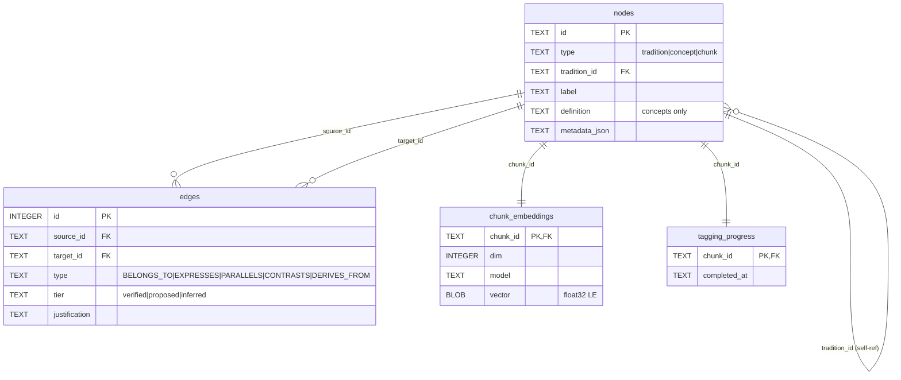
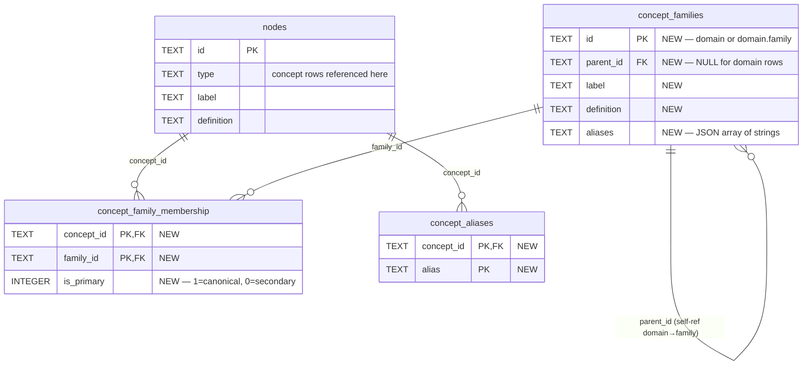
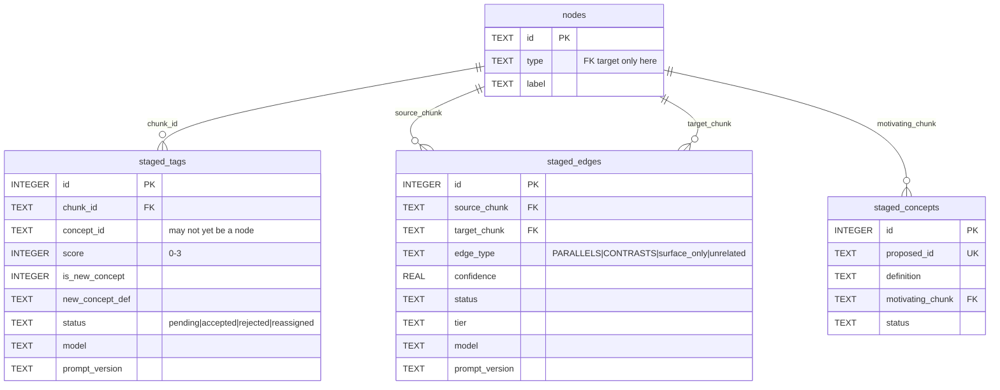
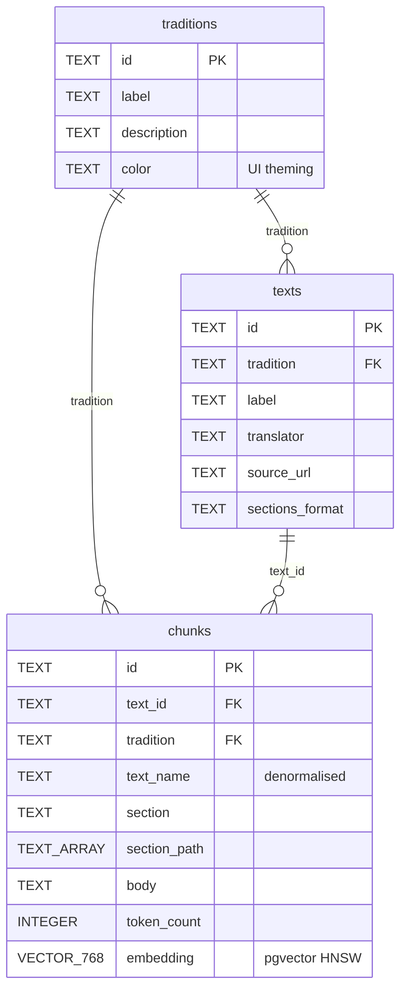
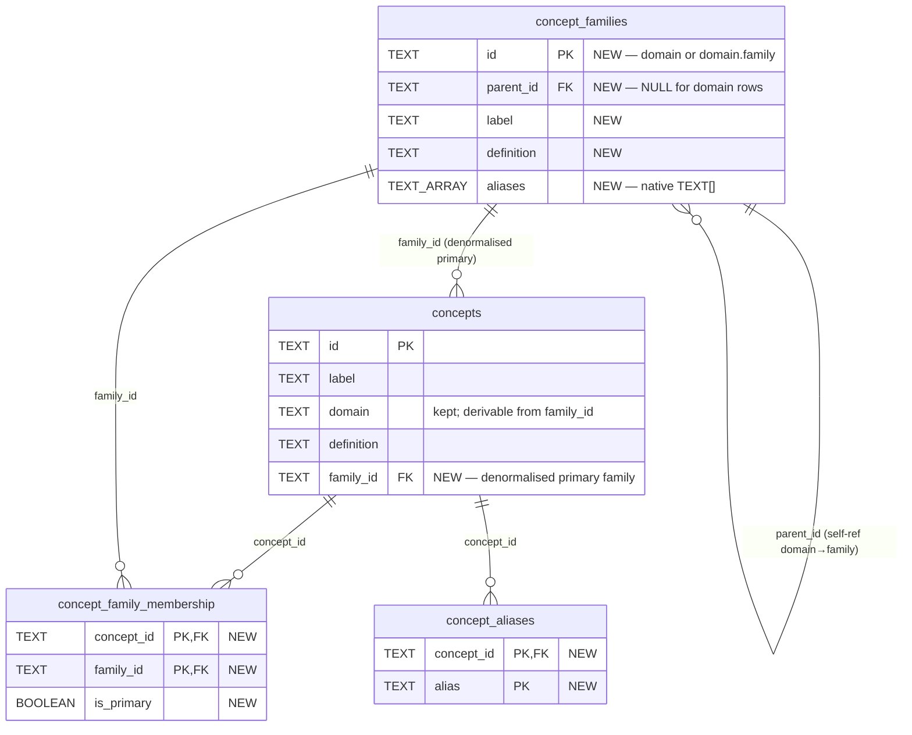
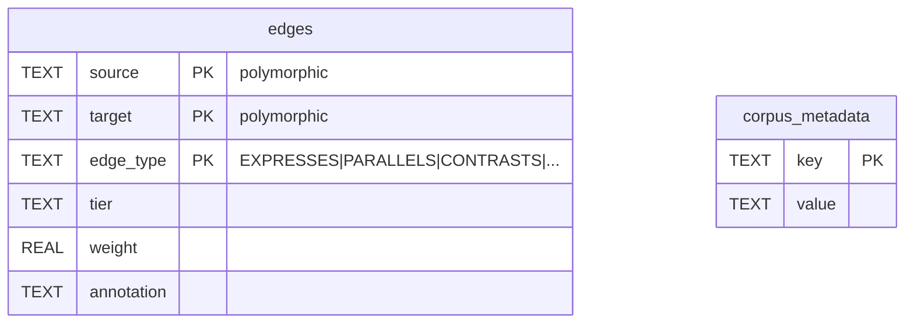

# Schema Diagrams — Local SQLite and Exported Postgres

Visual reference for the two databases in the guru system: the local SQLite (`data/guru.db`) where the pipeline writes, and the exported Postgres on the VPS where guru-web reads. Diagrams show **the full schema with the concept-hierarchy migration applied** — every existing table is preserved, with the migration's additions flagged "NEW" in the column comments and surfaced in section headers.

The migration described in [design.md](design.md) is purely additive: three new tables in each database plus one denormalised column on Postgres `concepts`. **No existing table is altered, no row is dropped, no concept ID is renamed.** If the migration were rolled back tomorrow, the un-NEW parts of these diagrams are exactly what would remain.

Rendered with Mermaid `erDiagram`. Noise columns (`reviewed_at`, `created_at`, `metadata_json`, etc.) are elided; consult `scripts/schema.sql` and `guru-web/schema/corpus-schema.sql` for full column lists. Each database is split into topical sub-diagrams to keep individual canvases readable — the dense FK-to-`nodes` topology in SQLite produces an illegible strip when crammed into one image.

Pre-rendered SVG artifacts live in [`img/`](img/). Regen recipe at the bottom.

---

## 1. Local SQLite

The pipeline source-of-truth. Polymorphic `nodes` table (concepts, chunks, traditions share an ID space), `edges` between them, staging tables for LLM output pending review.

### 1.1 Live graph + bookkeeping (no NEW content — current production)

The persisted state — what the pipeline considers ground truth. Unchanged by the migration.



### 1.2 Concept hierarchy (entirely NEW — added by the migration)

Three new tables. `nodes` is shown for FK context — its `type='concept'` rows are what `concept_family_membership` and `concept_aliases` reference. None of `nodes`' columns change.



`concept_family_membership` enforces "exactly one primary family per concept" via a partial unique index on `(concept_id) WHERE is_primary = 1`. Reverse-lookup index on `(family_id)` supports "which concepts are in this family." `concept_aliases` indexes `alias` for LIKE matching from the query path.

### 1.3 Pipeline staging (no NEW content — current production)

LLM output pending human review. The review CLI promotes accepted rows into `edges` (tags) or `nodes` (new concepts). Unchanged by the migration.



**Population shape of the NEW tables.** Family rows ship populated (sync from `concepts/taxonomy.toml`); `concept_family_membership` ships with `is_primary = 1` rows populated, `is_primary = 0` rows empty in v1; `concept_aliases` ships empty; family `aliases` ship empty or hand-seeded. All grow organically through review actions and surfaced query patterns.

---

## 2. Exported Postgres (guru-web)

The export artifact built by `scripts/export.py` and loaded into the VPS Postgres at `guru-corpus`. Denormalised for read-side simplicity; pgvector handles embeddings; `edges` stays polymorphic (untyped `source`/`target` text) so the same table carries chunk↔concept and concept↔concept.

### 2.1 Corpus structure (no NEW content — current production)

Traditions, texts, and chunks. The denormalised `chunks` table is what vector search returns.



### 2.2 Concepts + hierarchy (`concepts.family_id` is NEW; three NEW tables)

`concepts` gains a `family_id` column (denormalised primary family). Three new tables mirror the SQLite shape with native Postgres types: `aliases` is `TEXT[]` not JSON, `is_primary` is `BOOLEAN` not `INTEGER`. The conversion happens in `export.py`'s `load_families` / `load_concept_family_membership` emitter blocks.



The `concepts.family_id` denormalisation is intentionally redundant with `concept_family_membership WHERE is_primary` — turns "filter chunks by family" from a three-way join (`chunks` → `edges` → `concepts` → `concept_family_membership`) into a two-way one. The membership table remains the audit table; `family_id` is the convenience column.

**`concepts.domain` is kept**, not dropped. Derivable from `concept_families.parent_id` of the row pointed at by `family_id`, but every existing query in `src/lib/` that filters by domain keeps working unchanged. Removing it is a separate cleanup, out of scope for this migration.

### 2.3 Edges and metadata (no NEW content — current production)

`edges` is the polymorphic graph — `source` and `target` are bare text references the web app resolves against the appropriate table per `edge_type`. Chunks → concepts (EXPRESSES) and concept → concept (PARALLELS / CONTRASTS) coexist here. `corpus_metadata` is the key/value manifest loaded last by the export artifact so a mid-load failure leaves it absent.



**The hierarchy doesn't add any new edge types.** Family-level expansion at retrieval time happens through joins via `concept_family_membership`, not through new edge rows. `edges` stays exactly as it is today.

---

## 3. The two databases at a glance

| concern | local SQLite | exported Postgres |
|---|---|---|
| **identity model** | polymorphic `nodes` (concepts/chunks/traditions share an ID space) | denormalised: separate `traditions`, `texts`, `chunks`, `concepts` tables |
| **graph** | `edges` with FKs to `nodes` | `edges` polymorphic (`source`/`target` untyped TEXT) |
| **embeddings** | `chunk_embeddings.vector` as float32 BLOB | `chunks.embedding` as pgvector VECTOR(768), HNSW indexed |
| **staging** | `staged_tags`, `staged_edges`, `staged_concepts` (LLM output pending review) | *(none — staging never exported)* |
| **bookkeeping** | `tagging_progress` | *(none — bookkeeping never exported)* |
| **NEW from this migration** | `concept_families` + `concept_family_membership` + `concept_aliases` (§1.2) | same three tables + denormalised `concepts.family_id` (§2.2) |
| **aliases storage** | JSON-encoded text on `concept_families.aliases`; rows in `concept_aliases` | native `TEXT[]` on `concept_families.aliases`; rows in `concept_aliases` |
| **conversion boundary** | — | `scripts/export.py` (read SQLite → emit Postgres COPY statements) |

**What never crosses the boundary.** The `staged_*` tables and `tagging_progress` are pipeline-internal; the export emits only reviewed, promoted state. The hierarchy work doesn't change this — family memberships and aliases are taxonomy state (always exported), not in-flight LLM output (never exported).

**What changes when the migration ships.** Three new emitter blocks in `export.py` (`load_families`, `load_concept_family_membership`, `load_concept_aliases`), one enrichment to `load_concepts` (adding `family_id`), `SCHEMA_VERSION` bumps from 2 to 3, and `src/lib/graph.ts` learns to expand family/domain matches into concept sets.

---

## Regenerating the SVGs

Requires `@mermaid-js/mermaid-cli` on PATH. The pipeline produces six SVGs corresponding to the six `\`\`\`mermaid` blocks above (numbered 1–6 by appearance) and renames them to descriptive filenames.

```bash
# Mermaid's default uses <foreignObject> for labels — only browsers render those.
# Force native <text> elements so the SVG works in image viewers, IDE previews, etc.
cat > /tmp/mmdc-config.json <<'EOF'
{
  "htmlLabels": false,
  "flowchart": { "htmlLabels": false },
  "themeVariables": { "fontSize": "16px" }
}
EOF

mmdc -i docs/concept-hierarchy/schema-diagrams.md \
     -o docs/concept-hierarchy/img/schema.svg \
     -c /tmp/mmdc-config.json \
     -w 2400 -H 1800 --backgroundColor white

# Two post-processing fixes that mmdc cannot do natively:
#   1. --backgroundColor sets a CSS background; image viewers ignore CSS.
#      Inject a real <rect> sized to the viewBox so the background is part
#      of the SVG. "100%" resolves against the viewport and renders as a
#      tiny corner square in strict viewers; use literal viewBox dimensions.
#   2. htmlLabels:false splits each word into its own <tspan> with the
#      separating space at the start of the next tspan; rsvg-convert and
#      similar strip leading whitespace from tspan content unless the
#      parent <text> carries xml:space="preserve".
for f in docs/concept-hierarchy/img/schema-*.svg; do
  vb=$(grep -oE 'viewBox="[^"]+"' "$f" | head -1 | sed 's/viewBox="//;s/"$//')
  w=$(echo "$vb" | awk '{print $3}')
  h=$(echo "$vb" | awk '{print $4}')
  sed -i "s|\(<svg [^>]*>\)\(<style>\)|\1<rect x=\"0\" y=\"0\" width=\"$w\" height=\"$h\" fill=\"white\"/>\2|" "$f"
  sed -i 's|<text |<text xml:space="preserve" |g' "$f"
done

cd docs/concept-hierarchy/img && \
  mv schema-1.svg local-live.svg && \
  mv schema-2.svg local-hierarchy.svg && \
  mv schema-3.svg local-staging.svg && \
  mv schema-4.svg exported-corpus.svg && \
  mv schema-5.svg exported-concepts.svg && \
  mv schema-6.svg exported-edges.svg
```
