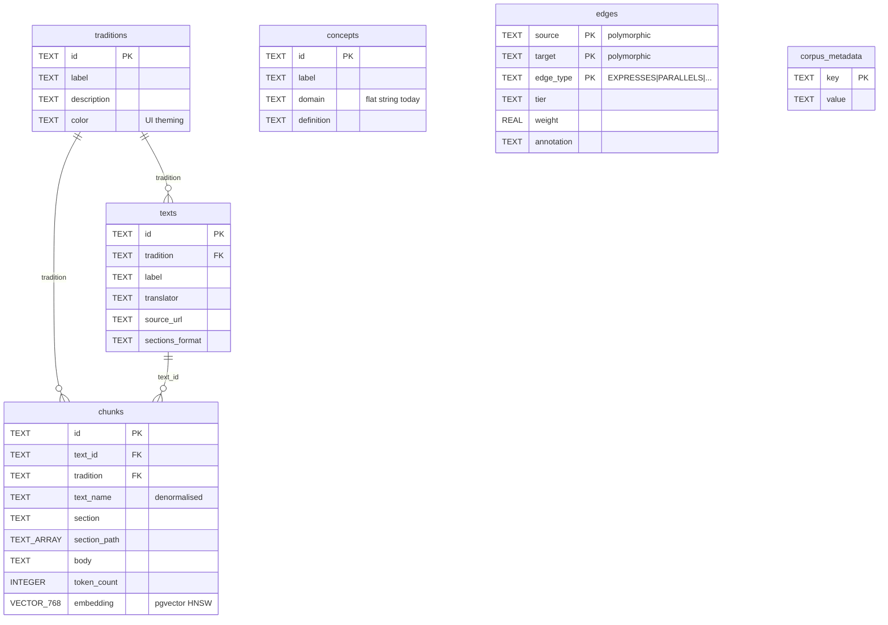

# Schema Diagrams — Local SQLite and Exported Postgres

Visual reference for the two databases in the guru system: the local SQLite (`data/guru.db`) where the pipeline writes, and the exported Postgres on the VPS where guru-web reads. Diagrams are paired before/after the concept-hierarchy migration described in [design.md](design.md).

Rendered with Mermaid `erDiagram`. Tables show primary keys (PK), foreign keys (FK), and key columns. Noise columns (`reviewed_at`, `created_at`, `metadata_json`, etc.) are elided to keep the diagrams readable; consult `scripts/schema.sql` and `guru-web/schema/corpus-schema.sql` for the full column lists.

---

## 1. Local SQLite — current state

The pipeline source-of-truth. Uses a polymorphic `nodes` table (concepts, chunks, traditions all share an ID space) with `edges` between them. Staging tables hold LLM output pending review; bookkeeping table tracks what's been tagged.

```mermaid
erDiagram
    nodes {
        TEXT id PK
        TEXT type "tradition|concept|chunk"
        TEXT tradition_id FK
        TEXT label
        TEXT definition "concepts only"
        TEXT metadata_json
    }

    edges {
        INTEGER id PK
        TEXT source_id FK
        TEXT target_id FK
        TEXT type "BELONGS_TO|EXPRESSES|PARALLELS|CONTRASTS|DERIVES_FROM"
        TEXT tier "verified|proposed|inferred"
        TEXT justification
    }

    chunk_embeddings {
        TEXT chunk_id PK_FK
        INTEGER dim
        TEXT model
        BLOB vector "float32 LE"
    }

    staged_tags {
        INTEGER id PK
        TEXT chunk_id FK
        TEXT concept_id "may not yet be a node"
        INTEGER score "0-3"
        INTEGER is_new_concept
        TEXT new_concept_def
        TEXT status "pending|accepted|rejected|reassigned"
        TEXT model
        TEXT prompt_version
    }

    staged_edges {
        INTEGER id PK
        TEXT source_chunk FK
        TEXT target_chunk FK
        TEXT edge_type "PARALLELS|CONTRASTS|surface_only|unrelated"
        REAL confidence
        TEXT status
        TEXT tier
        TEXT model
        TEXT prompt_version
    }

    staged_concepts {
        INTEGER id PK
        TEXT proposed_id UK
        TEXT definition
        TEXT motivating_chunk FK
        TEXT status
    }

    tagging_progress {
        TEXT chunk_id PK_FK
        TEXT completed_at
    }

    nodes ||--o{ nodes : "tradition_id (self-ref)"
    nodes ||--o{ edges : "source_id"
    nodes ||--o{ edges : "target_id"
    nodes ||--|| chunk_embeddings : "chunk_id"
    nodes ||--o{ staged_tags : "chunk_id"
    nodes ||--o{ staged_edges : "source_chunk"
    nodes ||--o{ staged_edges : "target_chunk"
    nodes ||--o{ staged_concepts : "motivating_chunk"
    nodes ||--|| tagging_progress : "chunk_id"
```

**Reading the model.** `nodes` is the universe of identities. `edges` is the live graph between them — `EXPRESSES` for chunk→concept tags, `PARALLELS` / `CONTRASTS` for cross-tradition concept relationships, `BELONGS_TO` for chunk→tradition membership, `DERIVES_FROM` for derivation chains. Everything in the `staged_*` family is LLM output pending human review; the review CLI promotes accepted rows into `edges` (for tags) or into `nodes` (for new concepts).

The taxonomy lives **outside** this schema today — `concepts/taxonomy.toml` is the source of truth for the flat domain→concept mapping, and `nodes` carries only `id`, `label`, `definition` for each concept with no structural relationship between them beyond what `edges` happens to express.

---

## 2. Local SQLite — future state (post-hierarchy)

Adds three new tables. Existing tables are unchanged.

```mermaid
erDiagram
    nodes {
        TEXT id PK
        TEXT type "tradition|concept|chunk"
        TEXT tradition_id FK
        TEXT label
        TEXT definition
        TEXT metadata_json
    }

    edges {
        INTEGER id PK
        TEXT source_id FK
        TEXT target_id FK
        TEXT type
        TEXT tier
        TEXT justification
    }

    chunk_embeddings {
        TEXT chunk_id PK_FK
        INTEGER dim
        TEXT model
        BLOB vector
    }

    staged_tags {
        INTEGER id PK
        TEXT chunk_id FK
        TEXT concept_id
        INTEGER score
        TEXT status
        TEXT model
        TEXT prompt_version
    }

    staged_edges {
        INTEGER id PK
        TEXT source_chunk FK
        TEXT target_chunk FK
        TEXT edge_type
        TEXT status
        TEXT model
        TEXT prompt_version
    }

    staged_concepts {
        INTEGER id PK
        TEXT proposed_id UK
        TEXT motivating_chunk FK
    }

    tagging_progress {
        TEXT chunk_id PK_FK
        TEXT completed_at
    }

    concept_families {
        TEXT id PK "domain or domain.family"
        TEXT parent_id FK "NULL for domain rows"
        TEXT label
        TEXT definition
        TEXT aliases "JSON array"
    }

    concept_family_membership {
        TEXT concept_id PK_FK
        TEXT family_id PK_FK
        INTEGER is_primary "1=canonical home, 0=secondary"
    }

    concept_aliases {
        TEXT concept_id PK_FK
        TEXT alias PK
    }

    nodes ||--o{ nodes : "tradition_id"
    nodes ||--o{ edges : "source_id"
    nodes ||--o{ edges : "target_id"
    nodes ||--|| chunk_embeddings : "chunk_id"
    nodes ||--o{ staged_tags : "chunk_id"
    nodes ||--o{ staged_edges : "source_chunk"
    nodes ||--o{ staged_edges : "target_chunk"
    nodes ||--o{ staged_concepts : "motivating_chunk"
    nodes ||--|| tagging_progress : "chunk_id"

    concept_families ||--o{ concept_families : "parent_id (self-ref)"
    nodes ||--o{ concept_family_membership : "concept_id"
    concept_families ||--o{ concept_family_membership : "family_id"
    nodes ||--o{ concept_aliases : "concept_id"
```

### What's new

- **`concept_families`** — both domain rows (`parent_id = NULL`) and family rows (`parent_id` → their domain). One self-referential FK carries both tiers. `aliases` is a JSON-encoded array for user-facing query synonyms.
- **`concept_family_membership`** — unified table for primary and secondary affiliations. `is_primary = 1` rows are canonical homes (one per concept, enforced by partial unique index `idx_concept_primary_family` on `concept_id WHERE is_primary = 1`); `is_primary = 0` rows are cross-cutting secondary affiliations. Forward index on PK, reverse-lookup index `idx_concept_family_membership_family` on `family_id`.
- **`concept_aliases`** — concept-level synonyms for query matching (`monad` ↔ `the One`). Multiple rows per concept; index on `alias` supports LIKE lookups.
- **`nodes` is unchanged.** The taxonomy migration is purely additive — no columns added to existing tables in SQLite, no concept IDs renamed, no rows touched in `edges` or `staged_tags`.

### What's deferred

- `concept_family_membership` ships with `is_primary = 0` rows empty in v1. Secondary memberships populate organically through review actions, not from the TOML.
- `concept_aliases` ships empty. Populated incrementally as natural-language queries surface.
- Family `aliases` JSON columns ship empty (or with a small hand-seeded set). Same growth pattern.

---

## 3. Exported Postgres (guru-web) — current state

The export artifact built by `scripts/export.py` and loaded into the VPS Postgres at `guru-corpus`. Denormalised for read-side simplicity; pgvector handles embeddings; the `edges` table is intentionally polymorphic (untyped `source`/`target` text) so the same table carries chunk↔concept and concept↔concept edges.



**Reading the model.** `traditions` and `texts` are the corpus-organisation skeleton. `chunks` is the searchable substrate, denormalised so a vector hit returns its tradition and text name without joins. `concepts` is a flat list keyed only by ID, with `domain` as a free-form string (no FK, no normalised hierarchy). `edges` is the polymorphic graph — its `source` and `target` are bare text references that the web app resolves against the appropriate table per `edge_type`. `corpus_metadata` is a key/value manifest; loaded last by the export artifact so a mid-load failure leaves it absent and the web app refuses to serve.

**The asymmetry with SQLite.** The pipeline's polymorphic `nodes` table becomes three separate tables (`traditions`, `texts`, `chunks`) on the export side — denormalisation for read performance — and `concepts` becomes its own table. The pipeline's `edges` carries the same shape on both sides; only the FK constraints differ.

---

## 4. Exported Postgres — future state (post-hierarchy)

Adds three new tables (mirroring the SQLite shape, with native Postgres types instead of JSON-encoded text) and one denormalised column on `concepts`. Existing tables are otherwise unchanged.

```mermaid
erDiagram
    traditions {
        TEXT id PK
        TEXT label
        TEXT description
        TEXT color
    }

    texts {
        TEXT id PK
        TEXT tradition FK
        TEXT label
        TEXT translator
        TEXT source_url
        TEXT sections_format
    }

    concepts {
        TEXT id PK
        TEXT label
        TEXT domain "kept; derivable from family_id"
        TEXT definition
        TEXT family_id FK "NEW: denormalised primary family"
    }

    chunks {
        TEXT id PK
        TEXT text_id FK
        TEXT tradition FK
        TEXT text_name
        TEXT section
        TEXT body
        VECTOR_768 embedding
    }

    edges {
        TEXT source PK
        TEXT target PK
        TEXT edge_type PK
        TEXT tier
        REAL weight
        TEXT annotation
    }

    corpus_metadata {
        TEXT key PK
        TEXT value
    }

    concept_families {
        TEXT id PK
        TEXT parent_id FK "NULL for domain rows"
        TEXT label
        TEXT definition
        TEXT_ARRAY aliases "native TEXT[]"
    }

    concept_family_membership {
        TEXT concept_id PK_FK
        TEXT family_id PK_FK
        BOOLEAN is_primary
    }

    concept_aliases {
        TEXT concept_id PK_FK
        TEXT alias PK
    }

    traditions ||--o{ texts : "tradition"
    traditions ||--o{ chunks : "tradition"
    texts ||--o{ chunks : "text_id"

    concept_families ||--o{ concept_families : "parent_id (self-ref)"
    concept_families ||--o{ concepts : "family_id (denormalised)"
    concepts ||--o{ concept_family_membership : "concept_id"
    concept_families ||--o{ concept_family_membership : "family_id"
    concepts ||--o{ concept_aliases : "concept_id"
```

### What's new

- **`concept_families`** — same shape as SQLite, but `aliases` is native `TEXT[]` instead of JSON-encoded text. Conversion happens in `export.py`'s `load_families` (the only place that crosses the storage boundary).
- **`concept_family_membership`** — same shape, with `BOOLEAN` `is_primary` instead of `INTEGER 0/1`. Partial unique index `idx_concept_primary_family ON (concept_id) WHERE is_primary` + reverse-lookup index on `family_id`.
- **`concept_aliases`** — same shape, native types.
- **`concepts.family_id`** — denormalised column added to the existing table. Redundant with `concept_family_membership WHERE is_primary` (the primary row) but turns "filter chunks by family" from a three-way join into a two-way one (`chunks` → `edges` → `concepts`). The membership table remains the audit table; `family_id` is the convenience column.
- **`concepts.domain`** — kept. Derivable from `concept_families.parent_id` of the row pointed at by `family_id`, but every existing query in `src/lib/` that filters by domain keeps working unchanged. Removing it is a separate cleanup, out of scope for this migration.

### What's still polymorphic

`edges` retains its polymorphic `source`/`target` design — chunks → concepts (EXPRESSES) live alongside concept → concept (PARALLELS, CONTRASTS) in the same table. The hierarchy doesn't add any new edge types or relationships to `edges`. Family-level expansion at retrieval time happens through joins via `concept_family_membership`, not through new edge rows.

---

## 5. The two databases at a glance

| concern | local SQLite | exported Postgres |
|---|---|---|
| **identity model** | polymorphic `nodes` (concepts/chunks/traditions share an ID space) | denormalised: separate `traditions`, `texts`, `chunks`, `concepts` tables |
| **graph** | `edges` with FKs to `nodes` | `edges` polymorphic (`source`/`target` untyped TEXT) |
| **embeddings** | `chunk_embeddings.vector` as float32 BLOB | `chunks.embedding` as pgvector VECTOR(768), HNSW indexed |
| **staging** | `staged_tags`, `staged_edges`, `staged_concepts` (LLM output pending review) | *(none — staging never exported)* |
| **bookkeeping** | `tagging_progress` | *(none — bookkeeping never exported)* |
| **taxonomy structure** (post-migration) | `concept_families` + `concept_family_membership` + `concept_aliases` | same three tables + denormalised `concepts.family_id` |
| **aliases storage** | JSON-encoded text on `concept_families.aliases`; rows in `concept_aliases` | native `TEXT[]` on `concept_families.aliases`; rows in `concept_aliases` |
| **conversion boundary** | `scripts/export.py` (read SQLite → emit Postgres COPY statements) |  |

**What never crosses the boundary.** The `staged_*` tables and `tagging_progress` are pipeline-internal; the export emits only reviewed, promoted state. The hierarchy work doesn't change this: family memberships and aliases are taxonomy state (always exported), not in-flight LLM output (never exported).

**What changes when the hierarchy ships.** From the export pipeline's perspective: three new emitter blocks in `export.py` (`load_families`, `load_concept_family_membership`, `load_concept_aliases`), one enrichment to `load_concepts` (adding `family_id`), and `SCHEMA_VERSION` bumps from 2 to 3. From the consumer's perspective: three new tables to query, one new column on an existing table, and `src/lib/graph.ts` learns to expand family/domain matches into concept sets.
